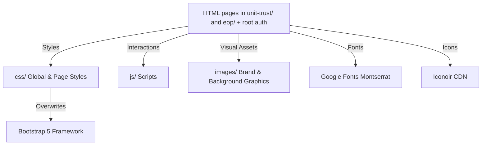

# System Patterns

## Technical Architecture
The PMO Corporate Portal is a high-fidelity frontend prototype built on standard web technologies. It is entirely serverless (presentation-only) and runs natively in any standard browser.



### Core Technologies
- **Markup**: HTML5 using semantic layout structures (`<header>`, `<main>`, `<section>`, `<footer>`).
- **Styles**: Custom Vanilla CSS combined with **Bootstrap 5.3.0** (or modern Bootstrap CDN) for responsive grid utilities.
- **Interactions**: Native Vanilla JavaScript (ES6+).
- **Typography**: Google Fonts Montserrat.
- **Iconography**: Iconoir open-source minimalist icon package.

## Project Directory Layout
```
PMO corporate/
├── css/                     # Custom stylesheets
├── js/                      # Page logic & interactions
├── images/                  # Mock screenshots, backgrounds, and logos
├── unit-trust/              # Unit Trust Portal HTML (dashboard, accounts, authorise, …)
├── eop/                     # Employer Online Portal HTML (dashboard, intro)
├── memory-bank/             # Project state & context documents
├── skills/                  # Workspace custom skill packages
│   └── pmo-design/
├── index.html               # Login (root)
├── register.html, forgot.html, internet_risk.html, terms_conditions.html
└── …
```

## Key Code & Coding Patterns

### 1. Style Encapsulation and Bootstrap Overrides
We use Bootstrap 5 for fast responsive layouts, but completely customize its defaults to match the **Pro Max** premium design specifications in `ui_ux_standards.md`:
- **Cards**: Customize `.card` class with `border-radius: 15px` and rich box shadows (`0 10px 30px rgba(0,0,0,0.2)`).
- **Buttons**: Customize `.btn` class with `border-radius: 25px` (pills) and custom state transitions (`transition: all 0.3s ease`).
- **Fonts**: Embed Montserrat and define `font-family: 'Montserrat', sans-serif !important` across the global styles.

### 2. Global Scope Isolation in JavaScript
To prevent variable conflicts across pages, Javascript logic must be wrapped inside a `DOMContentLoaded` event listener, creating an isolated closure:
```javascript
document.addEventListener('DOMContentLoaded', () => {
    // Isolated application scope
    const loginForm = document.getElementById('loginForm');
    
    loginForm.addEventListener('submit', (e) => {
        e.preventDefault();
        // Handler code...
    });
});
```

### 3. Explicit DOM Element Labeling
To facilitate seamless testing, documentation, and agent manipulation, all interactive elements must have explicit and unique IDs:
- Form fields: `#usernameInput`, `#passwordInput`
- Trigger buttons: `#clearBtn`, `#loginBtn`, `#submitBtn`
- Dynamic containers: `#alertContainer`, `#btnSpinner`

### 4. Semantic UI Color Conventions
When creating status indicators, alerts, or text highlights, developers must follow the semantic scaling established in our design system:
- **Red (`#ff1700`)**: Primary actions, critical warnings, urgent alerts.
- **Navy (`#002e77`) / Dark Purple (`#373761`)**: Base UI, header titles, professional boundaries.
- **Success (`#12a833`)**: Successful processes, completed transfers, authorised items.
- **Warning (`#ce7226`)**: Pending items, verification required.
- **Neutral Blue (`#dce3e8`) / Support Gray (`#8e9ab0`)**: Inactive container highlights, subtle subtitles, visual background shapes.
